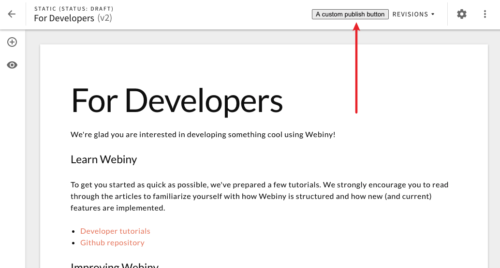

## 🆕 What’s New In Webiny 4.12.0?

In this week’s release, we introduce a couple of fixes and improvements in different areas of Webiny. Let’s check them out!

## 🚀 Features

**Customize your SSR build** ([#1220](https://github.com/webiny/webiny-js/pull/1220))

You can now customize your SSR build by providing paths to your app HTML file and app component factory. In most cases, you won’t need it and Webiny defaults will work fine for you. But if you do find yourself in a situation where you need to tweak your HTML or app component — now you can do it. A shout out goes to [Latotty](https://github.com/latotty) for this and many other improvements in this release!

## 🐞 Bug Fixes

**Page Builder — overriding editor and page elements plugins work correctly** ([#1242](https://github.com/webiny/webiny-js/pull/1242)

This PR enables overriding parts of the Page Builder editor and page elements, which wasn’t possible before due to an issue in the order in which the plugins were registered internally. So, if you wanted to override existing plugins and modify existing or add new functionality to the page builder and/or page elements, you can do that now!

**Clean deploy output in CI environment** ([#1236](https://github.com/webiny/webiny-js/pull/1236))

When deploying infrastructure locally, there’s a status bar that shows the current state of the deployment process. However, CI environments are non-interactive, and dynamic logs like that cause a lot of useless noise in the output. We’ve now disabled dynamic logging when executed in the CI environment, so your logs are nice and readable 🎉.

## ⬇️️ Try the Latest Release

Give Webiny a try by following our [Quick Start](https://docs.webiny.com/docs/get-started/quick-start), which will guide you through the initial setup steps.

If you have an existing Webiny project, you can upgrade your project by running `yarn upgrade`.

And, just in case you’ve missed it, check out **[the full changelog](https://github.com/webiny/webiny-js/releases/tag/v4.12.0)**.

## 🙌 Community Updates

### 👥 New Contributors

As always, let’s start by giving a shout out to our new contributors👏

**[Mark Wilcox](https://github.com/markwilcox)** for being a very active community member.

**[Latotty](https://github.com/latotty)** for working on the Customize your SSR build ([#1220](https://github.com/webiny/webiny-js/pull/1220)) and [many other issues](https://github.com/webiny/webiny-js/pulls?q=is%3Apr+author%3Alatotty+is%3Aclosed).

Webiny’s community is actively growing, we have around 250+ members who continuously build their serverless projects using Webiny 🚀

Webiny provides you a/an:

- ✅ Developer-friendly environment
- ✅ Open Source Project
- ✅ Community 💛 [Join us today](http://webiny.com/slack?utm_source=Webiny-blog&utm_medium=webiny-slack-community&utm_campaign=weekly-updates-blog-sep-21&utm_content=weekly-updates-blog-sep-21&utm_term=W00041)

### 🔬 Requested Features by You; Our Community

`Add DynamoDB as one of the supported databases` — Is one of the most requested features by our community. Guess what?🥁⏳

Check out our [roadmap updates](https://www.webiny.com/roadmap?utm_source=Webiny-blog&utm_medium=webiny-website&utm_campaign=weekly-updates-blog-sep-21&utm_content=weekly-updates-blog-sep-21&utm_term=W00040) 🚀

### 📃Webiny’s Top 10 Favorite NPM Packages

At Webiny we post our favorite NPM packages daily 🙃

Check out our [top 10 favorite NPM packages](/blog/webinys-top-10-favorite-npm-packages-e9dc560e56ff) 🚀

### 😎 Get Your Swag

To show our appreciation to all our **contributors 🌟 **and **supporters ⚡️**, we are giving away free swag.

Visit our **[Swag page](https://www.webiny.com/swag/?utm_source=Webiny-blog&utm_medium=webiny-swag-page&utm_campaign=weekly-updates-blog-sep-21&utm_content=weekly-updates-blog-sep-21&utm_term=W00042)** to get more details on how you can claim your swag!

## 🤝 Get Involved

We encourage everyone to get involved and contribute, regardless of their experience level. Read the [contributing guide](https://github.com/webiny/webiny-js/blob/master/CONTRIBUTING.md), and if you still run into problems, just give us a ping on [Slack](https://www.webiny.com/slack), we will help you out.

Our development team is on standby to help your in-house team to learn and adopt Webiny — all free of cost!

## 🚀 We are hiring

We are looking for a member to join our team.
If you are interested? Apply for the [Full-Stack JavaScript Engineer](https://careers.webiny.com/full-stack-javascript-engineer/en) role.

Since we are a small team, in this role, you’ll have a significant opportunity to directly influence the technical and product design choices we will make.
