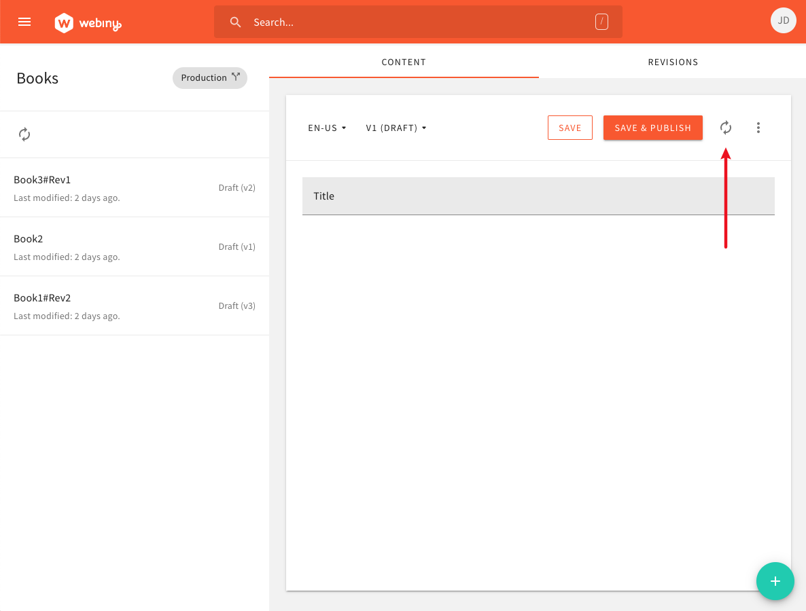
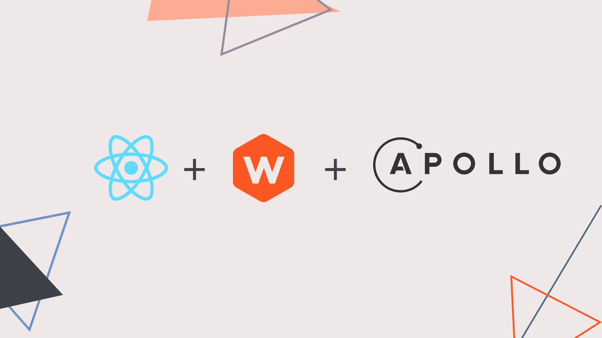

## 🆕 What’s New In Webiny 4.10.0?

In this week’s release, we introduce a couple of improvements and fixes in different areas of Webiny. Let’s check them out!

## 🚀 Features

**Added refresh content button ([a38b458](https://github.com/webiny/webiny-js/commit/a38b4586a2c1094afc0c024e8365ae33a1edc7ee))**

A small but useful addition can be found in the content editing form. We added the refresh content button, which, as the name itself suggests, refreshes the content entry you’re currently looking at. This can be useful if for some reason the data isn’t up-to-date (for example, another user made updates on it in the meantime), and you want to get the latest data as quickly as possible, without refreshing the whole page.

## 🐞 Bug Fixes

**Ref fields are always referencing the correct revision ([#1204](https://github.com/webiny/webiny-js/pull/1204)**

Until now, every time a content entry would reference another content entry via the Reference field, it would always point to a specific content entry revision, even if new revisions of the referenced content entry were created. From now on, the reference field will, respectively, always point to the latest and published revisions, on READ (e.g. [myApi.net/cms/read/production](http://myapi.net/cms/read/production)) and MANAGE (e.g. [myApi.net/cms/manage/production](http://myapi.net/cms/manage/production)) APIs.

#### Migration: 
Note that this new functionality will not work on previously saved content, meaning, ref fields on existing content entries will still behave like always — point to a specific content entry revision (instead of the latest / published, like described above). In order to “fix” those, you will need to open the entries that contain a value in the ref field save them. This will cause the links in the background to be updated, and from that point on, everything will work as expected for that particular entry. If you have a lot of data that needs to be updated, let us know, we might help you with creating a simple database script (it’s fairly simple).

## ⬇️ Try the Latest Release

Give Webiny a try by following our [Quick Start](https://docs.webiny.com/docs/get-started/quick-start), which will guide you through the initial setup steps.

If you have an existing Webiny project, you can upgrade your project by running `yarn upgrade`.

And, just in case you’ve missed it, check out [the full changelog](https://github.com/webiny/webiny-js/releases/tag/v4.10.0)**.

## 🙌 Community Updates

#### 🎙 Webiny at the GCS Recruitment Specialists Serverless Event

Our CEO, [Sven Al Hamad](https://www.linkedin.com/in/ACoAAAFcdwQB9E157ZB9V-NEaycIt18s1VDVW6g) is invited to the UK Serverless event next Tuesday, September 8th at 12 pm! (GMT+1) 💢

Speaking about hidden pitfalls that come with having a serverless infrastructure and how to overcome them using an open-source framework for building full-stack serverless applications.

✅ Register [here](https://us02web.zoom.us/webinar/register/WN_BD0dpRsrSLCCsLJYTilz4g).

👍 Join the Meetup [here](https://www.meetup.com/UK-GCS-Connect-Serverless/).

### 📚Knowledge sharing

**Commodo**This week, we completed our [21-part video series](https://www.youtube.com/playlist?list=PL9HlKSQaEuXRU5rPOlv3vPWeWew7-bMep) that covers Commodo — Webiny’s #1 library of choice when it comes to data-modeling and working with the application data. In it, our lead developer and creator of the [Commodo library](https://github.com/webiny/commodo), [Adrian](https://twitter.com/doitadrian), shows you everything that there is to know about it and how to use it as efficiently as possible. 🥁

Learn the basics of Commodo from the Core Ideas, Data Validation, Nested Fields, Custom Higher-Order Functions, Dynamic Hooks, and Storage.

<iframe width="560" height="315" src="https://www.youtube.com/embed/A6TVfbfrr6k" frameborder="0" allow="accelerometer; autoplay; clipboard-write; encrypted-media; gyroscope; picture-in-picture" allowfullscreen></iframe> 

To advanced topics such as Storage — advanced queries, hooks. Reference fields many-to-one & one-to-one, one-to-many, many-to-many.

<iframe width="560" height="315" src="https://www.youtube.com/embed/X7-HQF6t2fc" frameborder="0" allow="accelerometer; autoplay; clipboard-write; encrypted-media; gyroscope; picture-in-picture" allowfullscreen></iframe>
 

Our Lead Developer [Adrian](https://twitter.com/doitadrian)** **guides you through your Commodo journey ⚡

Show some 💛 by [subscribing to our YouTube channel](https://www.youtube.com/channel/UCI5TBif-unrpn5htTRxXPQw?sub_confirmation=1), hitting the like button, and leaving some comments along the way 🎉

### 💡Build a Portfolio Website with React, Webiny, and Apollo ([link](https://docs.webiny.com/docs/tutorials/build-a-portfolio-website-with-react-webiny-apollo/))

In this tutorial, Webiny’s DevRel [Albiona](https://twitter.com/albionaitoh) guides you through the tutorial to create a portfolio website to showcase your projects and your blogs using [React](https://reactjs.org/), [Webiny Headless CMS](https://www.webiny.com/serverless-app/headless-cms), and [Apollo GraphQL](https://www.apollographql.com/). After setting up your portfolio website, you will be able to focus all of your creativity on the content for blogs and projects.

---

## 🤝 Get Involved

We encourage everyone to get involved and contribute, regardless of their experience level. Read the [contributing guide](https://github.com/webiny/webiny-js/blob/master/CONTRIBUTING.md), and if you still run into problems, just give us a ping on [Slack](https://www.webiny.com/slack), we will help you out.

Our development team is on standby to help your in-house team to learn and adopt Webiny — all free of cost!

## 🚀 We are hiring

We are looking for a member to join our team.
If you are interested? Apply for the **[Full-Stack JavaScript Engineer](https://careers.webiny.com/full-stack-javascript-engineer/en) role**.

Since we are a small team, in this role, you’ll have a significant opportunity to directly influence the technical and product design choices we will make.