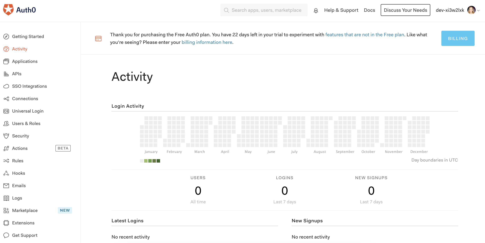

If you're reading this article, you might be interested to learn how to implement user management
for your application, understanding the complete picture of how identity management services work.
That's what we'll do in this article. You'll learn what is Identity as a Service (IDaaS),
why to use such a service, what is Single Sign-On (SSO), and IDaaS platforms.

Let's dive in!

## What is an Identity Provider as a Service (IDaaS)?

### Manual user identity management

In order to get access to an application, back in the days, you would have to share your credentials
such as your username and password with the application maintainers.

For a developer, user identity management is a complex feature to build and manage, especially
security-wise. You'd be responsible if someone would gain access (hack) into the users' identities and use those for their purposes.

Let's go through a real-life scenario where your client has requested to implement the Login/Registration
feature for the application you're building.

Inspired by the <ExternalLink href="http://dev.to">dev.to</ExternalLink> platform, as seen in the image below,
your client wants to give the users an option to access the application using the social accounts such
as Twitter or GitHub.

### **Open Authentication and OpenID Connect protocols**

After some research, you learn that to implement this feature there are **internet standards** you have to use,
such as **Open Authentication 2.0 (OAuth 2.0), and OpenID Connect (OIDC).**

**OAuth** is a **security standard** where you give one application permission to access your data in another
application - instead of giving them your **username** and **password** - you give one app **a key**
(in this case the Twitter or Github key). We (the internet) refer to this as **authorization.**
You authorize the [dev.to](http://dev.to) platform to **access your data** on Twitter or GitHub on
your behalf, without giving them your **password**.

Using the **OAuth 2.0** standard, you will implement the requested feature for your client, giving the
users the option to access the platform via 3rd party services.

**But where does the OIDC come in?** The dev.to case is a simple authorization, the client will not have
access to your data. When the client requires your personal information, that's where the **OIDC** comes in.

**OIDC** is a thin layer that sits on top of **OAuth 2.0** and gives access to personal information
(like first and last name, for example). **OAuth** enables authorization from one app to another,
and the **OIDC** gives the information about the person that is logged in, which is often called **identity.**

When the **authorization server\*** (the Twitter or GitHub applications) supports **OIDC**,
it is sometimes called an **Identity Provider** - since it provides information about
the **resource owner\*** back to **the client**. However, you will only be able to authenticate
using the particular service credentials.

With a proper IDaaS (Identity as as Service) provider, you'll be able to configure more
ways to authenticate, and have one centralized layer of access control.
Let's learn more about what IDaaS is in the following section.

### **Identity as a Service provider (IDaaS)**

To better understand what is an IDaaS, we'll continue with the context of the client who has other requests regarding the login/registration feature.
The client, inspired by the <ExternalLink href="http://acloudguru.com">acloudguru.com</ExternalLink> platform,
requires implementing another 5-6 options to login/register, as seen in the image below:

Implementing 5-6 other services will require a notable effort, and with that comes the maintenance overhead.

But, you don't have to implement those services from scratch.
You can use an Identity-as-a-Service platform such as **Auth0**
(there are others too, we'll talk about them alter in the article).

_Wait, what is Auth0?!_

**Auth0** is a cloud-based system that provides solutions for businesses' user and
identity management processes. **Auth0** can manage tasks such as registration, login,
and password reset, naming a few. So, **Auth0** provides a platform for authentication,
authorization, and secure access for applications, devices, and users.

Using **Auth0**, you can implement the additional services super fast. **Auth0** offers
developers the option to prove an app's or an API’s authenticity using different
**identity providers (**GitHub, Twitter, Facebook, Google, etc.**)**, whatever the platform may be.

### How does IDaaS actually work?

To use an IDaaS, you don't need to be an expert on the identity protocols such as **OAuth**
or **OIDC** we talked about earlier. Let's go through a typical IDaaS authentication flow using
Auth0 as an example (but the same flow applies to all other IDaaS providers).

You first integrate your app with **Auth0** (using their SDK). Then, when a user tries to login,
your app will redirect the user to an **Auth0** customizable login page, where he logs in
either using username/password combination, or a 3rd party authorization server (Twitter, Github, etc.).
Once logged in, the user is redirected back to your app with an authorization code,
which is then exchanged for a [JSON Web Token (JWT)](https://auth0.com/docs/tokens/json-web-tokens)
from Auth0. The JWT will then be used to call your APIs, and will also contain basic information about the user.

A cloud guru (**ACG**): **ACG → Auth0 → GitHub (**3rd party authorization providers**) → Auth0 → ACG**

- **ACG** is only communicating with **Auth0**

**Auth0** provides an amazing dashboard for you when you sign up, allowing you to see recent logins, new sign-ups, and total user counts.

## **What is SSO?**

IDaaS enables scenarios where **one login** can be used **across multiple applications**,
also known as a **Single-Sign-On** or **SSO**.
If all your apps use, for example, **Auth0,** to get the identity information,
then you can see how they are all talking to the same source of truth.

IDaaS internally is taking care of 3rd party authorization providers
(GitHub, Twitter, and many others) and then links everything into 1 single identity profile.

**SSO** login means that a user logs into an app with one set of credentials and
automatically is signed into all other apps that are linked to his profile within
the IDaaS provider. With **SSO**, the end-user gains access to multiple apps without
having to remember multiple credentials for different apps and login into each individual app.

A real-life example of **SSO** is Google, for it has plenty of software products.
Once you login into Gmail, you can automatically access YouTube, Google Drive,
Google Photos, and other Google products, as shown in the image below.

### The key benefits of SSO Login

- **Increased productivity**

  A single source of truth will reduce the time that was wasted.
  Now, users with just one password can access all apps from one organization.
  The UX is improved as well: there's no need to login multiple times, or reset passwords in each individual app.

- **Improving security**

  It is now easier to enforce password policies across the entire organization
  as well as enable multi-factor authentication across all apps.

- **Password fatigue**

  When you have multiple passwords to remember, it leads to "password fatigue".
  With **SSO,** the user has at most one password to remember.
  Or none at all, if using 3rd party authorization providers linked to your IDaaS.

## Why should you use an IDaaS provider?

Using an IDaaS can help in different aspects, such as with end-users and business management.
Some key benefits to using an identity provider are:

- No need to build and maintain your own user database, setup authentication, and manage usernames and passwords.
- Quick and easy self-registration to your custom applications.
- Users don't need to remember additional passwords.

**Customer Benefits of Using an IDaaS**

- **A great user experience**

  Customers will have a single identity to navigate between multiple applications they use.

- **Password protection**

  With IDaaS users will use a single password, making it easier to generate, remember, and recover/reset.

- **Time saving**

  Here is a fact check:

  > Johns Hopkins estimated significant time savings by users since the
  > deployment of "Tap and Go" to date, with time savings in September
  > 2012 alone estimated at 2,550 man-hours... consistent with the time
  > savings reported in July and August 2012, the initial months of the
  > implementation. Source: Best Practices: <ExternalLink href="http://docs.media.bitpipe.com/io_11x/io_115401/item_884892/Best%20Practices_Single%20Sign%20On%20Drives%20Productivtiy%20Security%20and%20Adoption%20When%20Used%20with%20EHR%20at%20The%20Johns%20Hopkins%20Hospitalpdf.pdf">Single Sign-On Drives Productivity, Security, and Adoption When Used with EHR at The Johns
  > Hopkins Hospital</ExternalLink>

**Business Benefits of Using an IDaaS**

- **Improves return on investment (ROI)**

  Implementing identity management services is a critical component for your company's approach to security, but putting one in the work has an effect on the bottom line of your company's function. How does it improve the return on investment (ROI)?

  Using an identity management system you can save money by:

  - Reducing help desk issues
  - Increasing employee productivity
  - Increasing IT efficiency

- **Security**

  When end-users access 3rd party websites, the credentials are not stored and managed externally and this makes it risk-free.

- **Control**

  Organizations have control over the user and the resources they access from one location within the infrastructure.

- **Scaling**

  Having a central identity provider is the foundation of building a highly scalable organization.

## What are the most popular IDaaS providers?

Managing identities is one of the most challenging issues in software services.
There are plenty of Identity-as-a-Service (IDaaS) services that provide solutions for
identity management. Now we'll go through the most popular tools.

### <ExternalLink href="https://www.okta.com/"> Okta Identity Management</ExternalLink>

Okta is one of the leading platforms for Identity-as-a-Service (IDaaS).
Okta features include Provisioning, Single Sign-On (SSO), Active Directory (AD) and LDAP integration,
a centralized user identity layer, multifactor authentication (MFA), mobile identity management,
and different policies for the security and control of an organization/company.

For the Okta's <ExternalLink href="https://www.okta.com/pricing/">pricing</ExternalLink>, the most basic
features start at \$3 per user per month.

### <ExternalLink href="https://auth0.com/">Auth0</ExternalLink>

Auth0 is a cloud-based identity management platform.
Auth0 features include custom domains, embedded authentication,
single sign-on (SSO), database migration, etc.
Developers can create universal login details for employees and control social
logins, multi-factor authentication, and detect anomalies for registered apps.
Auth0 includes a user management dashboard, to help administrators handling password resets,
role-based permissions, etc.
Auth0's <ExternalLink href="https://auth0.com/pricing/"> pricing </ExternalLink> starts at a \$23 per user per month.

### <ExternalLink href="https://www.onelogin.com/">OneLogin</ExternalLink>

OneLogin is another identity platform that offers secure, scalable solutions.
OneLogin features include Single sign-on (SSO), multi-factor authentication(MFA), SmartFactor Authentication, Identity life cycle management, etc.
OneLogin's <ExternalLink href="https://www.onelogin.com/product/pricing"> pricing </ExternalLink> package starts at \$6 per user per month, including features such as SSO, Advanced Directory, Multi-Factor Authentication (MFA).

### <ExternalLink href="https://azure.microsoft.com/en-us/services/active-directory/">Microsoft Azure Active Directory(Azure AD)</ExternalLink>

Microsoft Azure Active Directory (Azure AD) is Microsoft’s cloud-based identity and access management service, which helps your employees
sign in and access resources in:

- external resources, such as Microsoft 365, the Azure portal, and thousands of other SaaS applications.
- internal resources, such as apps on your corporate network and intranet, along with any cloud apps developed by your own organization.

The Azure active directory offers features as Application management, Authentication,
Azure Active Directory for developers, Business-to-business, Conditional access, Enterprise users, etc.
You can access their <ExternalLink href="https://azure.microsoft.com/en-us/pricing/details/active-directory/">pricing</ExternalLink> page
to get more details on the pricing packages.

### <ExternalLink href="https://www.ory.sh/">Ory</ExternalLink>

Ory provides an open source ecosystem of services with
clear boundaries that solve authentication and authorization:

- ORY Hydra is an OAuth 2.0 and OpenID Connect provider.
- ORY Oathkeeper is an Identity and Access Proxy.
- ORY Keto is an access control server.
- ORY Kratos is an identity management server.

Each service works standalone but you can also combine them to get the full feature set.
Almost every application has the concept of users and permissions.

---

Now that you clearly understand Identity Providers and what they offer, you'll be able to decide if you want to
use such a service and focus on building business value or continue using and maintaining
a custom authentication solution. If you're interested in our future blog posts, **<ExternalLink href="https://upscri.be/flvvqm">subscribe </ExternalLink>** to our **newsletter** and you'll be notified when we have interesting topics to share!

---

Thanks for reading! My name is <ExternalLink href="https://twitter.com/albionaitoh">Albiona</ExternalLink> and I work as a
developer relations engineer at <ExternalLink href="https://www.webiny.com/">Webiny</ExternalLink>.
I enjoy learning new tech and building communities around them = )
If you have questions or just want to say hi, reach out to me via <ExternalLink href="https://twitter.com/albionaitoh">Twitter</ExternalLink>.
