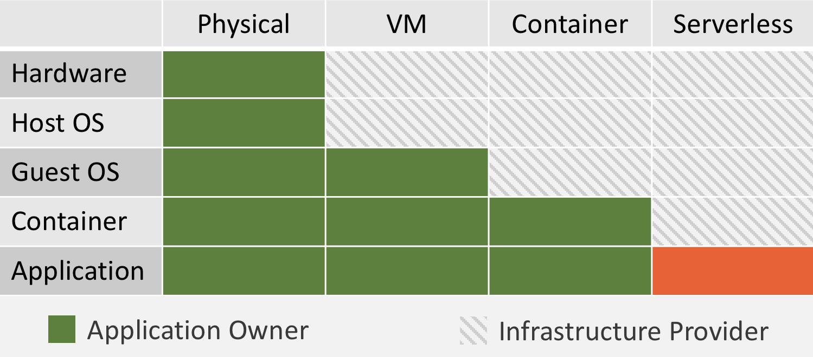
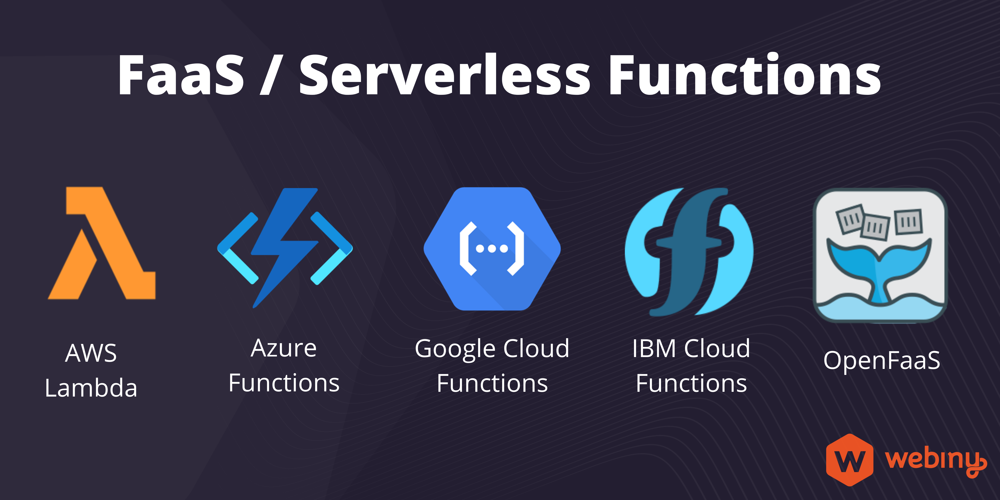
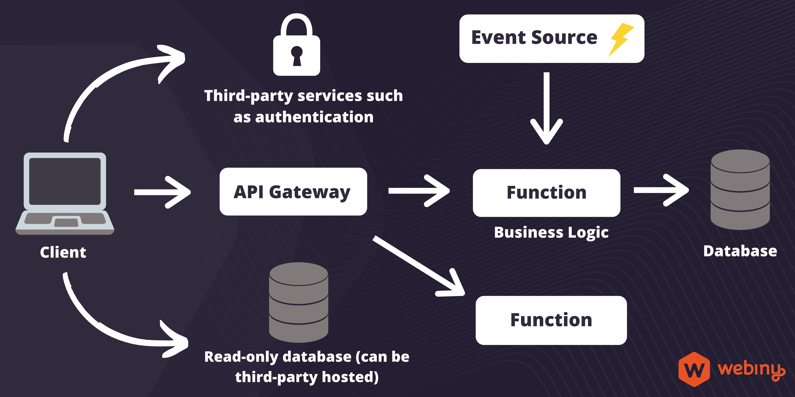
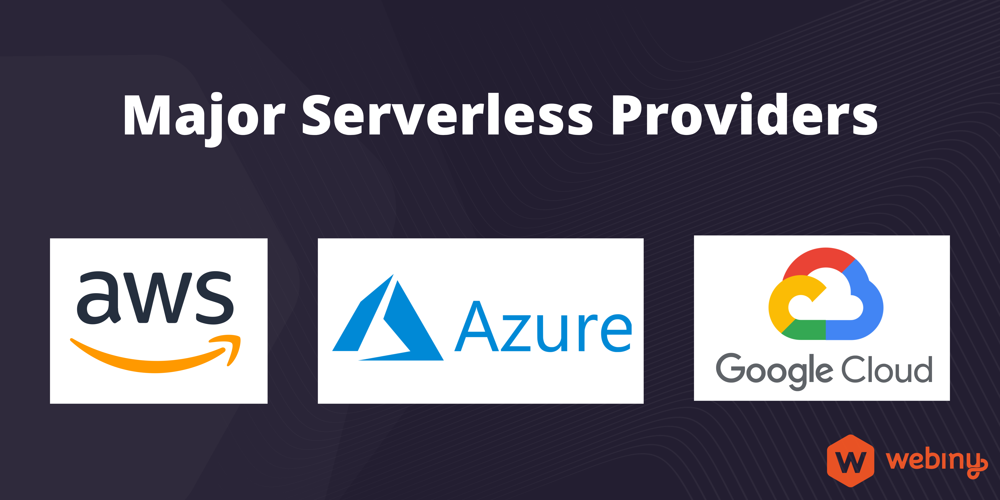

:::tip Preface
There are a lot of resources offering information about serverless technology, but most are covering a certain topic. Our goal is to create a simple knowledge base on serverless technology that will provide answers to the most commonly asked questions about serverless.
:::

What if you can only focus on building your application and don’t have to even think about managing the underlying infrastructure for running your application; Sounds like an ideal world for building applications, right?

Performance, security, and reliability are vital components of any modern application. The infrastructure played a critical role in achieving these goals. So, along with writing feature-rich applications, organizations face the overhead of managing the infrastructure to give the best user experience. 
As organizations grow their technology ecosystems, they start spending more time managing the infrastructure than building applications.

Serverless enables software teams to focus on developing business applications rather than spending time managing the servers and platform.

# Serverless Computing

## What is Serverless Computing?

Serverless computing lets you build and run applications and services without thinking about servers. It eliminates the need to manage infrastructure for your applications.
In the serverless world, your cloud service provider takes care of provisions, scales, and managing infrastructure required to run the code. So you are free from this massive responsibility and workload.

Although the serverless term is confusing at first glance, does serverless means no servers involved? Obviously, the answer is **No**. It’s just that you are no longer responsible for managing and provisioning the server. It will be abstracted from you and managed by your cloud provider.

As illustrated in the image, throughout the past couple of decades there has been a significant evolution from fully managing our own infrastructure to serverless today. Infrastructure is no longer our concern, it is managed by the infrastructure provider and your team can focus on building great applications.

> **"Focus on your application, not the infrastructure!"**

The serverless approach works for all size projects and has proven to unlock significant savings. Scaling, pay-per-use, and saving substantial maintenance costs are some highlighting aspects that make it a preferable choice for all size projects.

Along with numerous small and mid-size organizations, serverless has been adopted by various enterprises like Netflix, Coca-Cola, Nielsen, The Guardian, Reuters, AOL, Telenor, etc.

## What is FaaS / Serverless Function?

Function-as-a-Service, or FaaS, is a cloud computing service that enables developers to build, run, and manage application components as functions without maintaining their own infrastructure. It is an event-driven execution model that runs in stateless containers.

In FaaS, the application developers focus on writing business logic in terms of functions. These functions run in stateless ephemeral containers and are triggered by an event and managed entirely by the third-party vendor.

Functions are the individual components that make up that application. It is essentially a piece of 
code written by a developer executed in the cloud and runs on a stateless container that means they do their job, and then they disappear.

Some of the major FaaS providers are:

- [AWS Lambda](https://aws.amazon.com/lambda/)
- [Microsoft Azure Functions](https://azure.microsoft.com/en-in/services/functions/)
- [Google Cloud Functions](https://cloud.google.com/functions)
- [IBM Cloud Functions](https://cloud.ibm.com/functions/)
- [OpenFaaS](https://www.openfaas.com/)

## Benefits of serverless computing

Serverless computing brings several benefits in terms of costs, scalability, developer productivity. The following are the highlighting benefits of adopting serverless.

### No server maintenance

With serverless, you are no longer responsible for managing the infrastructure. Servers are still there, but they are abstracted away and managed by your cloud provider. So they are no longer your concern; the same goes for load balancers and many other operations.

### Auto Scaling

Serverless infrastructure is adapt at scale and is managed by your cloud provider.

Serverless functions spin up in milliseconds the moment there is an increase in demand. The newly created functions are immediately ready to handle new requests. And you, just sit back and relax. So no more scaling headaches. With serverless, you don't have to worry about the number of concurrent requests.

### Build things faster

By eliminating infrastructure overhead, your team can focus on the core application.

As you offload the routine tasks of provisioning and managing servers, the team can spend more time focusing on their apps. Because all you need to do is deploy your code, you won't lose time on spinning up and configuring servers. As a result, you'll iterate and launch products faster.

### Reduced operational costs

In serverless, you pay per function execution and not per hour. You no longer need to over-provision and overpay for infrastructure, especially in preparation for those periods of peak demand.

### Decreased time to market

Serverless significantly reduces time-to-market because of the modular-based, quick, and smaller releases. With serverless, quick deployments and updates are possible that enables the team to build the product in iteration and decrease time to market.

## Examples of serverless solutions

Serverless architectures excel in a variety of computing operations and provide an excellent infrastructure for modern applications. Let's discuss some use cases best fit for using serverless architecture.

### Multimedia processing

A common use case is the execution of some transformational process in response to file upload. For example, if an image is uploaded in an object storage service such as Amazon S3, trigger a function to create the thumbnail version of the image and store it. Similarly, another commonly used use case is the resizing images on the fly. AWS shared an [example](https://aws.amazon.com/blogs/compute/resize-images-on-the-fly-with-amazon-s3-aws-lambda-and-amazon-api-gateway/) illustration for resizing images on the fly.

### APIs and web applications

The various benefits discussed earlier regarding deployment, performance, scaling, and cost attract many users to deploy the web application in the serverless environment. Both static and dynamic web applications are a good fit for serverless architecture.
APIs implementation is another good use case for serverless. The majority of infrastructure providers provides tools to build APIs in the serverless environment. APIs with serverless architecture brings excellent benefits in scaling and cost.

### Stream processing at scale

Processing data within a potentially infinite stream of messages is another ideal use case to use serverless. The stream processing is compute-intensive and highly elastic; serverless is a perfect fit to achieve high performance.

### Batch jobs or scheduled tasks

Jobs that can be executed in batch mode or the scheduled task which will access the infrastructure resources for only a few minutes a day are a great fit for serverless. In traditional architectures, servers are kept ideal for most of the time compared to computation for these use cases; thus, serverless is a great choice for these use cases.

# Serverless Architecture

Serverless architecture is a software design pattern that describes ways to build and run applications and services without managing the infrastructure.

In serverless architectures, the business logic is broken down into small units called functions that are triggered by events. The function run in stateless compute containers and is ephemeral, and these containers are managed by the cloud provider. 
Serverless applications often extensively use third-party services to perform various functionalities.

With modern front end technologies, the client-side handles the application flow. It communicates with third party services and functions via API gateway and events to execute various operations. As illustrated in the diagram above, a serverless application is a combination of client-side logic, third-party services, and business logic often encapsulated in functions. 

## Serverless Applications

Serverless applications typically have the following components.

### Functions

As mentioned earlier, a function is an individual component that makes up the application. It is essentially a piece of code written by a developer executed in the cloud and runs on a stateless container. Functions can connect with any data source or third-party services.

### Event Source

Event source causes the triggering of functions. There can be various events like requests to endpoints, or changes in the data state or changes in resources state. Like, an event can be triggered on file upload in the data source. The cloud providers support various events.

### API Gateway

API Gateway allows developers to define HTTP endpoints, and these endpoints are mapped with functions. So, in general, the client sends the request to the API Gateway and API Gateway invoke the respective function to execute the business logic.

### Third-party services

The serverless architecture enables developers to use third-party services with built-in business logic, such as authentication. This helps in building things faster, as promised with serverless architecture.

## Serverless Database

Serverless computing principles have been extended to databases. Serverless databases acquired various characteristics of serverless platforms.

One of the critical decisions in architecting a scalable application is to decide how to store the data and which database to choose.
Database consideration is even more special in serverless because your database should inherit the serverless properties and benefits like scalability, cost, and management.
There are plenty of available options for serverless databases. Before looking into these options, let's jump into the advantages of using a serverless database.

### Advantages of Serverless Database

#### Scalability

Serverless databases are highly scalable. It can scale from hundreds to millions of transactions in a fraction of a second automatically based on traffic.

The database is a critical piece in an application and directly impacts the performance. With the serverless database, development teams don’t have to worry about database capacity. A Serverless database manages it under the hood, and your application gets the needed database resources quickly and efficiently.

#### Maintenance / Fully managed

As serverless promised, it removed the complexity of provisioning and managing servers. The same applies to databases as well. The serverless database relieved you from the provision, software installation, and maintenance of the database infrastructure.

Your providers fully manage it, enabling you to focus on your application and use the best in class database services.

#### Security

Security is probably the most crucial factor that is considered while evaluating a database. As your cloud provider manages the underlying infrastructure, it takes the responsibility of robust security.

The leading cloud provides like AWS,  Azure, GCP, and others have various serverless database offerings that are out of the box security layers for the databases.

#### Cost Efficiency

Another popular serverless computing characteristic is its cost-effectiveness because it has a pay-per-use model. You only pay for the resources that are consumed, this consumption-based pricing in databases significantly reduces the overall cost.

#### Availability & Performance

The infrastructure behind serverless databases offers built-in high availability and great performance. Behind the scene, your data has been replicated across multiple regions and the global distribution network improve the performance and availability at scale.

### List of Serverless Databases

#### Amazon DynamoDB

[Amazon DynamoDB](https://aws.amazon.com/dynamodb/) is a fully managed NoSQL database service by AWS that provides excellent performance with seamless scalability.

DynamoDB promises to deliver single-digit millisecond performance at any load. As per official docs, it supports more than 10 trillion requests per day and can handle the peaks of more than 20 million requests per second. DynamoDB also supports ACID transactions that enable building business-critical applications at scale.

#### Amazon Aurora

[Amazon Aurora Serverless](https://aws.amazon.com/rds/aurora/serverless/) is a configuration for [Amazon Aurora](https://aws.amazon.com/rds/aurora) with serverless offerings. It responds to applications needs and automatically scales the capacity, start up, and shut down.

After launching Aurora, AWS observed the load patterns and found there are many instances where most of the time customer is not using the provisioned database capacity but were paying for it. This inspired team to build the Aurora serverless offering. Aurora is great for infrequently used, unpredictable, or cyclical workloads.

#### Azure Cosmos DB Serverless

[Azure Cosmos DB serverless](https://docs.microsoft.com/en-us/azure/cosmos-db/serverless) offers consumption-based pricing with [Azure Cosmos DB](https://azure.microsoft.com/en-us/services/cosmos-db/). Azure Cosmos DB is a robust NoSQL database. It's a serverless offering charge for the request units consumed by database operations and the storage consumed by the data. As per the official docs, Cosmos DB guarantees the single-digit millisecond response time.

#### Google Cloud Datastore

[Google Cloud Datastore](https://cloud.google.com/serverless/whitepaper#storing_your_application_data) is a serverless NoSQL database offering from Google Cloud Platform that automatically scales based on traffic. It provides significant cost and maintenance savings over managing your own NoSQL database.

#### MongoDB Atlas Serverless

[MongoDB Atlas Serverless](https://www.mongodb.com/cloud/atlas/serverless) is the serverless offering on the MongoDB Atlas service. The serverless instances MongoDB Atlas automatically scales to meet the workload and you only for the operation you run. It is currently in the preview phase, and you can find more details [here](https://www.mongodb.com/blog/post/introducing-serverless-instances-mongodb-atlas-now-available-preview).

#### Fauna

[Fauna](https://fauna.com/serverless) is the data API, with it you can modernize your OLTP infrastructure to a serverless approach without sacrificing the capabilities that developers need for building rich business applications.

#### DataStax Astra DB

[DataStax Astra DB](https://www.datastax.com/products/datastax-astra) is a multi-cloud serverless Database-as-a-Service built on [Apache Cassandra](https://cassandra.apache.org/_/index.html). It claims to reduce the total cost of ownership by 75% with the serverless Cassandra offering. You can deploy it to AWS, GCP or Azure based on your preference. Global scaling and enterprise security are some highlighting features of Astra DB.

#### Macrometa

[Macrometa](https://www.macrometa.com/) is a serverless streaming NoSQL database with integrated compute engine and stream data processing. Its Globally Distributed NoSQL Database enables access to data in real-time at the lowest possible latency. You can also build stateful micro-services and real-time Data Pipelines with Macrometa.

#### PlanetScale

[PlanetScale](https://planetscale.com/) is a MySQL compatible serverless database. It is powered by [Vitess](https://vitess.io/), a database clustering system for horizontal scaling of MySQL. Database branching and connection strings are few concepts that make this platform unique.

# Serverless Providers

Serverless development scope is no longer limited to using FaaS offerings. Various components like database, monitoring, workflow, and other developer tools are important to build a complete serverless application. Various vendors have emerged in the serverless computing space. Let's have a look at some popular and innovative players from this space.

## Amazon AWS Serverless Computing

AWS offers various serverless services for computing, data storage, and application integration.

AWS Lambda is the most popular computing service that lets you run code without provisioning or managing servers and have a pay-per-use model. It was introduced in 2014 and very much popularized the serverless computing model.

Various AWS serverless services and tools like [AWS SAM](https://aws.amazon.com/serverless/sam/), [Amazon CloudWatch](https://en.wikipedia.org/wiki/Amazon_CloudWatch), and others work seamlessly to provide a unified experience to build serverless applications. You can find the complete list of [AWS serverless services here](https://aws.amazon.com/serverless/).

## Azure Serverless Solutions

[Azure serverless](https://azure.microsoft.com/en-in/solutions/serverless/) has a broad spectrum of serverless offerings, ranging from computing to database, DevOps to monitoring, storage to analytics, and many more. With a range of Azure serverless services and developer tools, you can build your serverless application seamlessly. 

[Azure Functions](https://azure.microsoft.com/en-us/services/functions/) was the first serverless service launched in the Azure serverless ecosystem in 2016. Since then, a range of serverless execution environments, fully managed services, and developer tools are added to the ecosystem to enhance serverless development and computing experience.

## Google Serverless Computing

[Google Cloud Platform](https://cloud.google.com/serverless) offers various services that enable you to develop and deploy highly scalable serverless applications. The popular serverless products from GCP are Cloud Functions, Cloud Run, and App Engine.

[Cloud Functions](https://cloud.google.com/functions) is scalable pay-as-you-go functions as a service (FaaS) to run your code without server maintenance.

[Cloud Run](https://cloud.google.com/run) is a Fully managed computing platform for deploying and scaling containerized applications quickly and securely.

[App Engine](https://cloud.google.com/appengine) is a fully managed serverless application platform with simple administration. You can write your code with any supported language & framework. Once the code is ready, with App Engine, you can seamlessly push your code and run it on the cloud. Along with auto-scaling capabilities, you pay for what you use.